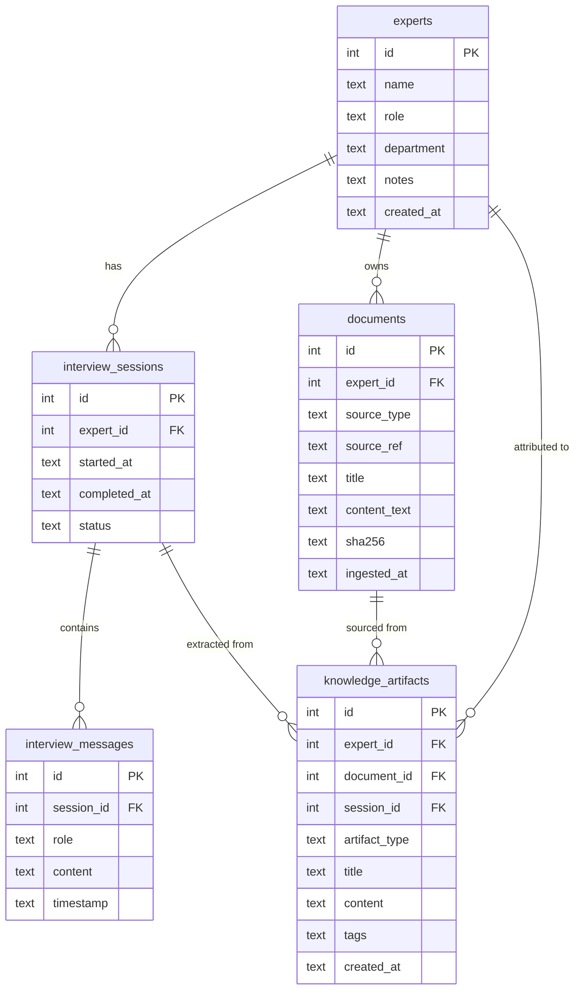

# MindVault Architecture

## Component Flow

```mermaid
flowchart TD
    subgraph UI["Streamlit UI (pages/)"]
        P1["🎙️ Interview"]
        P2["📥 Ingest"]
        P3["🔍 Query"]
        P4["🗂️ Artifacts"]
        P5["👤 Experts"]
    end

    subgraph LLM["LLM Layer (mindvault/llm/)"]
        CC["claude_client.py\nstreaming + vision"]
        IA["interview_agent.py\nsystem prompt + messages"]
        EX["extractor.py\nJSON artifact extraction"]
    end

    subgraph ING["Ingestion (mindvault/ingestion/)"]
        PDF["pdf_parser.py"]
        URL["url_fetcher.py"]
        IMG["image_ingester.py"]
        AUD["audio_ingester.py"]
    end

    subgraph VOICE["Voice (mindvault/voice/)"]
        STT["stt.py — Whisper"]
        TTS["tts.py — gTTS"]
    end

    subgraph RAG["RAG (mindvault/rag/)"]
        EMB["embedder.py\nchunk + upsert"]
        RET["retriever.py\nquery + synthesise"]
    end

    subgraph DB["Storage"]
        SQL["SQLite\nmindvault.db"]
        CHR["ChromaDB\nartifacts + resource_chunks"]
    end

    subgraph PROMPTS["prompts/"]
        PR1["interview_system.txt"]
        PR2["extraction_system.txt"]
        PR3["query_system.txt"]
        PR4["resource_analysis.txt"]
    end

    P1 --> IA --> CC
    P1 --> EX --> CC
    P1 --> EMB
    P1 --> STT
    P1 --> TTS
    P2 --> PDF & URL & IMG & AUD
    P2 --> EX
    P2 --> EMB
    P3 --> RET --> CC
    P4 --> SQL
    P5 --> SQL

    IA --> PR1
    EX --> PR2 & PR4
    RET --> PR3

    EMB --> CHR
    RET --> CHR
    P1 & P2 & P5 --> SQL
```



---

## Entity-Relationship Diagram



---

## ChromaDB Collections

| Collection | Content | Key Metadata Fields |
|---|---|---|
| `artifacts` | Structured knowledge artifacts (title + content combined) | `artifact_type`, `expert_id`, `source_ref` |
| `resource_chunks` | Raw text chunks from all ingested sources | `source_type`, `source_ref`, `expert_id`, `document_id`, `chunk_index` |

Both collections use ChromaDB's default `all-MiniLM-L6-v2` embeddings (no external API key required).

---

## Data Flow: Interview → Artifact

```
User speaks/types
      │
      ▼
STT (Whisper) ──► text
      │
      ▼
SQLite: append_message(session_id, "user", text)
      │
      ▼
Claude streams response (interview_system.txt + full history)
      │
      ▼
SQLite: append_message(session_id, "assistant", response)
      │
      ▼
turn_count % EXTRACTION_INTERVAL == 0?
      │  YES
      ▼
extractor.extract_artifacts(full_transcript)
  → Claude (extraction_system.txt) → JSON array
      │
      ▼
SQLite: create_artifact(...)
ChromaDB artifacts: upsert_artifact(...)
      │
      ▼
Toast: "N artifacts extracted"
```

---

## Data Flow: Document Ingest → RAG

```
File/URL/Text uploaded
      │
      ▼
Parser (pdf/url/text/image/audio) → raw text
      │
      ├──► SHA-256 dedup check → skip if duplicate
      │
      ▼
SQLite: create_document(...)
      │
      ├──► embedder.embed_and_store() → chunk_text(500w, 250 overlap)
      │         → ChromaDB resource_chunks: upsert per chunk
      │
      ├──► extractor.extract_artifacts() → SQLite + ChromaDB artifacts
      │
      └──► extractor.analyse_document() → summary + gap list shown in UI
```
