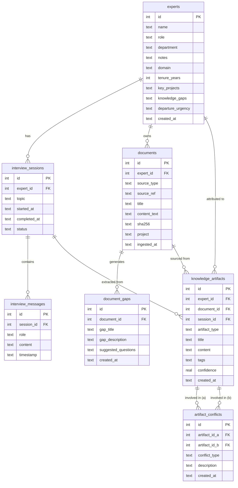

# MindVault Architecture

## Component Flow

```mermaid
flowchart TD
    subgraph UI["Streamlit UI (pages/)"]
        P1["Interview"]
        P2["Ingest"]
        P3["Query"]
        P4["Artifacts"]
        P5["Experts"]
    end

    subgraph LLM["LLM Layer (mindvault/llm/)"]
        CC["claude_client.py\nstreaming + vision"]
        IA["interview_agent.py\n4-phase prompt + re-probe"]
        EX["extractor.py\n7-type extraction + confidence"]
        CSC["consistency_checker.py\npost-session conflict detection"]
    end

    subgraph ING["Ingestion (mindvault/ingestion/)"]
        PDF["pdf_parser.py"]
        URL["url_fetcher.py"]
        IMG["image_ingester.py"]
        AUD["audio_ingester.py"]
    end

    subgraph VOICE["Voice (mindvault/voice/)"]
        STT["stt.py -- Groq cloud or faster-whisper"]
        TTS["tts.py -- gTTS"]
    end

    subgraph RAG["RAG (mindvault/rag/)"]
        EMB["embedder.py\nchunk + upsert"]
        RET["retriever.py\nquery + synthesise"]
    end

    subgraph DB["Storage"]
        SQL["SQLite\nmindvault.db"]
        CHR["ChromaDB\nartifacts + resource_chunks"]
    end

    subgraph PROMPTS["prompts/"]
        PR1["interview_system.txt"]
        PR2["extraction_system.txt"]
        PR3["query_system.txt"]
        PR4["resource_analysis.txt"]
        PR5["consistency_check.txt"]
    end

    P1 --> IA --> CC
    P1 --> EX --> CC
    P1 --> EMB
    P1 --> STT
    P1 --> TTS
    P1 --> CSC --> CC
    P2 --> PDF & URL & IMG & AUD
    P2 --> EX
    P2 --> EMB
    P3 --> RET --> CC
    P4 --> SQL
    P5 --> SQL

    IA --> PR1
    EX --> PR2 & PR4
    RET --> PR3
    CSC --> PR5

    EMB --> CHR
    RET --> CHR
    P1 & P2 & P5 --> SQL
```



---

## Entity-Relationship Diagram



---

## Artifact Types

| Type | Description |
|---|---|
| `heuristic` | Reusable rule of thumb extracted from experience |
| `if_then_rule` | Conditional logic: "IF X THEN Y" |
| `case_example` | Concrete narrative instance demonstrating a principle |
| `red_flag` | Warning signal with escalation trigger: "when you see X, stop" |
| `mental_model` | How the expert frames a problem domain |
| `exception` | Known deviation from a rule: "applies except when..." |
| `decision_factor` | Recurring variable the expert always weighs before deciding |

Artifacts with `artifact_type = mental_model` and `confidence < 0.7` trigger a re-probe instruction injected by `interview_agent.py` on the next interview turn.

---

## ChromaDB Collections

| Collection | Content | Key Metadata Fields |
|---|---|---|
| `artifacts` | Structured knowledge artifacts (title + content combined) | `artifact_type`, `expert_id`, `source_ref`, `confidence` |
| `resource_chunks` | Raw text chunks from all ingested sources | `source_type`, `source_ref`, `expert_id`, `document_id`, `chunk_index`, `project` |

Both collections use ChromaDB's default `all-MiniLM-L6-v2` embeddings (no external embedding API required).

---

## Data Flow: Interview to Artifact

```
User speaks/types
      |
      v
STT (Groq cloud or faster-whisper) --> text
      |
      v
SQLite: append_message(session_id, "user", text)
      |
      v
interview_agent: build system prompt (4-phase, document context, re-probe if needed)
      |
      v
Claude streams response (interview_system.txt + full history)
      |
      v
SQLite: append_message(session_id, "assistant", response)
      |
      v
turn_count % EXTRACTION_INTERVAL == 0?
      |  YES
      v
extractor.extract_artifacts(full_transcript)
  -> Claude (extraction_system.txt) -> JSON array with confidence scores
      |
      v
SQLite: create_artifact(...)       [confidence stored per artifact]
ChromaDB artifacts: upsert_artifact(...)
      |
      v
get_low_confidence_mental_models(artifacts)
      |  any found?
      v
interview_agent injects re-probe instruction on next system prompt turn
      |
      v
[session completed]
      |
      v
consistency_checker.run_for_expert(expert_id)
  -> Claude (consistency_check.txt) -> JSON conflict array
      |
      v
SQLite: create_artifact_conflict(...) per detected pair
```

---

## Data Flow: Document Ingest to RAG

```
File/URL/Text uploaded
      |
      v
Parser (pdf/url/text/image/audio) -> raw text
      |
      +---> SHA-256 dedup check -> skip if duplicate
      |
      v
SQLite: create_document(...)
      |
      +---> embedder.embed_and_store()
      |         -> chunk_text(500 words, 250-word overlap)
      |         -> ChromaDB resource_chunks: upsert per chunk
      |
      +---> extractor.extract_artifacts() -> SQLite + ChromaDB artifacts
      |
      +---> extractor.analyse_document()
                -> summary + gap list
                -> SQLite: create_document_gap() per gap
                -> displayed in UI with suggested interview questions
```

---

## License

© 2026 Kiran Gade (KG). All rights reserved.
